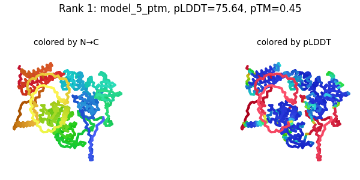
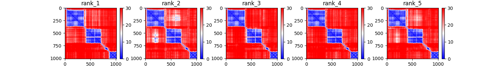
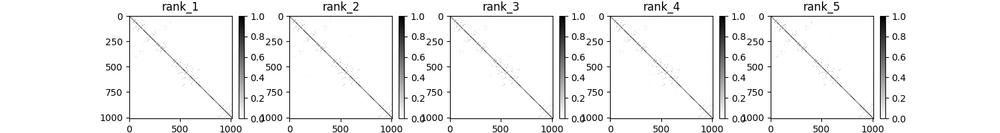
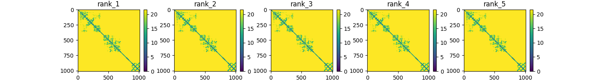
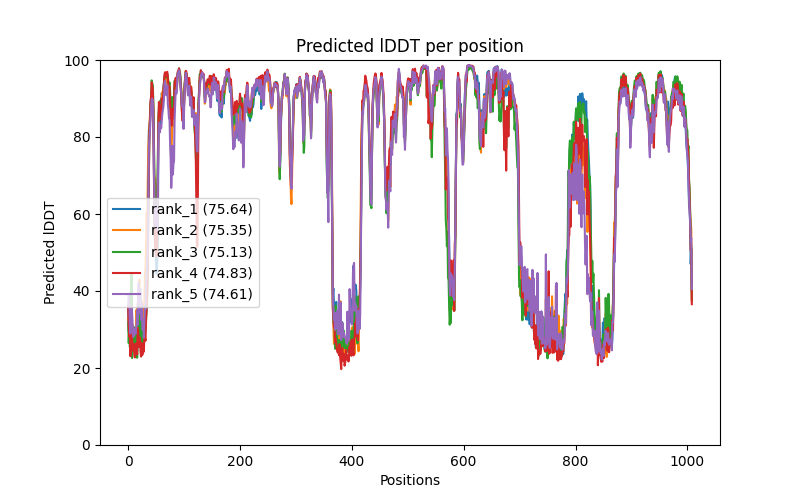

# Prerequisites

This is not meant to be an exhaustive guide on how to use ibex and a linux terminal, so if you're completely unfamiliar with these concepts, I recommend you to take a look at the following resources first:

- What is Ibex?

  Ibex is a computer cluster that you can access to run "jobs" or execute programs that require large amounts of memory, CPU or GPU power. If you want to learn more you can check out the [Ibex training site](https://www.hpc.kaust.edu.sa/ibex/training) or the [user guide](https://www.hpc.kaust.edu.sa/ibex/ibex_guide).

  You can connect to ibex from your Terminal application (Mac) with the following command (without the brackets around your username):

  ```bash
  ssh [your_username]@glogin.ibex.kaust.edu.sa
  ```

  To connect in Windows, you need an ssh client application such as [PuTTY](https://www.putty.org/).

- What is a terminal?

  If you're not familiar with the use of a Unix terminal/shell, you would greatly benefit from watching this [introductory workshop](https://www.youtube.com/watch?v=QB4JgAVgJHo) by the KAUST Visualization Core Lab, inspired from this [short course](https://swcarpentry.github.io/shell-novice/) by Software Carpentry.

  Also check out this "[linux cheat sheet](https://i.redd.it/isnefnt32wn21.jpg)" for a list of common commands. The ones in the section called "Files & Navigating" will be the most useful to you.

- How do I transfer files between ibex and my computer?

  To connect to ibex through the Finder application (Mac only), go to the menu `Go -> Connect to Server...` , and then write the address to ibex in the text field: `smb://samba.ibex.kaust.edu.sa` and press Connect. Then select from the list `ibex_scratch` to connect to your scratch directory in ibex. You can now drag and drop files between ibex and your local storage, create and delete directories, etc.

  For connecting in a Windows computer, you could try a tutorial such as the [following](https://www.techrepublic.com/article/how-to-connect-to-linux-samba-shares-from-windows-10/) (haven't tried it myself), or contact ibex@hpc.kaust.edu.sa for instructions.


# Installation
## Installing Miniconda

You need to have Miniconda installed in your home directory in ibex. If you already have it installed, you can skip to "Install Alphafold":

1. Login to Ibex through your Terminal application (mac) with the command:

    ```bash
    ssh [your_username]@glogin.ibex.kaust.edu.sa
    ```

   For logging in on Windows, you need an ssh client application such as [PuTTY](https://www.putty.org/).

2. Download the Miniconda installation script, and run it.

    ```bash
    wget https://repo.anaconda.com/miniconda/Miniconda3-latest-Linux-x86_64.sh
    bash Miniconda3-latest-Linux-x86_64.sh
    ```

    <span style='background-color:yellow;color:black'>Note</span>: The installation assistant will prompt you for input in a few steps, to accept the license agreement, and if you want to set a custom installation directory. You can just accept the defaults. Near the end, when it asks you the following:

    ```
    Do you wish the installer to initialize Miniconda3
    by running conda init?
    ```

    In here you should type `yes` and press enter.

3. Load modifications onto your current session:

    ```bash
    source ~/.bashrc
    ```

4. Done! You should see either `(miniconda3)` or `(base)` in you terminal before the prompt, which means conda was installed correctly and the `base` environment is activated. If you are still unsure about the process, you can checkout the following [video](https://www.youtube.com/watch?v=X-W7aVXH3_w) in the KAUST Visualization Core Lab YouTube channel with the detailed steps.

## Installing AlphaFold

Follow these steps to install your instance of AlphaFold in Ibex:

1. Login to Ibex through your Terminal application (mac) with the command:

    ```bash
    ssh [your_username]@glogin.ibex.kaust.edu.sa
    ```

   For logging in on Windows, you need an ssh client application such as [PuTTY](https://www.putty.org/).

2. Go to your scratch directory:

    ```bash
    cd /ibex/scratch/[your_username]/
    ```

3. Clone the following repositories, and then `cd` into the `alphafold` directory.

    ```bash
    git clone https://github.com/strubelab/alphafold.git
    git clone https://github.com/guzmanfj/Executor.git
    cd alphafold
    ```

4. Create a virtual environmnet to work on, and activate it. This step will take 15-30 minutes, so make sure you don't lose your connection to ibex.

    ```bash
    conda env create --prefix ./env --file environment.yml
    ```

    Once the environment is created, make sure to activate it afterwards:

    ```
    conda activate ./env
    ```

5. Install the newly downloaded `alphafold` and `Executor` packages in your current environment:

    ```bash
    pip install -e ../Executor
    pip install -e .
    ```

6. Done! The alphafold wrapper should be installed now. Check that you can use the `alphafold_wrapper` command by running **`alphafold_wrapper --help`**

    ```
    usage: alphafold_wrapper [-h] [--input INPUT [INPUT ...]] --destination DESTINATION [--gpus GPUS] [--time TIME] [--mem MEM] [--recycles RECYCLES] [--cpus CPUS]
                         [--models_to_relax {all,best,none}] [--use_precomputed_msas] [--mail MAIL] [--multimer_predictions_per_model MULTIMER_PREDICTIONS_PER_MODEL]
                         [--gpu_type {v100,a100}]

    Takes one or more FASTA files with amino acid sequences (one for each model), and submits a job array to ibex to run AlphaFold on each file.

    options:
      -h, --help            show this help message and exit
      --input INPUT [INPUT ...]
                            Fasta file(s) with the sequence(s) to model. Provide one fasta file for each model that you want to produce.
      --destination DESTINATION
                            Path for saving the resulting AlphaFold models. It will create one subdirectory for each model. Also will contain the sequence files as they were submitted to
                            ibex, the script that was submitted and the ibex stdout files.
      --gpus GPUS           Number of GPUs to request to ibex. It is likely that AlphaFold only ever uses 1. (default=1)
      --time TIME           Time in minutes to give to each job. (default="auto")
      --mem MEM             Memory in GB to allocate to each job. (default="auto")
      --recycles RECYCLES   Only for monomeric models. Set the number of times to recycle the output through the network. More recycles might help to mildly improve the quality of the
                            models in some cases. Default is 3, max recommended is 10. Multimeric models run up to 20 recycles, but will stop if the difference in pairwise distances is less
                            than 0.5.
      --cpus CPUS           Number of CPUs to request. The MSA programs are set to use 8, which is the default here.
      --models_to_relax {all,best,none}
                            The models to run the final relaxation step on. If `all`, all models are relaxed, which may be time consuming. If `best`, only the most confident model is
                            relaxed. If `none`, relaxation is not run. Defaults to `best`.
      --use_precomputed_msas
                            Set this flag if you want to reuse the MSA outputs from a previous run, for example if there was an error after the MSA step and you want to start the same run
                            again, or if you want to make the same model but with a different number of recycles. Make sure to copy the old results to a new directory if you don't want to
                            overwrite them.
      --mail MAIL           Email to send notifications about the job progess in ibex.
      --multimer_predictions_per_model MULTIMER_PREDICTIONS_PER_MODEL
                            Number of multimeric predictions to make for each of the 5 ML models that AlphaFold runs. The total number of structures (pdb files) predicted will be 5 times
                            this number (e.g. `--multimer_predictions_per_model 5` will give 25 structures in total). Defaults to 1. NOTE: if you indicate more than 1, you might have to
                            increase the time to be requested with the --time argument as well.
      --gpu_type {v100,a100}
                            Whether to use V100 or A100 GPU. If you don't know what this is, leave the default. (Default=v100)
    ```

# Usage

1. Login to ibex, navigate to the `alphafold` directory installed earlier, and activate the conda environment:

    ```bash
    ssh [your_username]@glogin.ibex.kaust.edu.sa
    cd /ibex/scratch/[your_username]/alphafold  # the exact location might vary depending 
                                                # on where you cloned the repository
    conda activate ./env
    ```

2. Run the `alphafold_wrapper` program:

    There are basically two scenarios for making models:

    A. Make one or multiple models from scratch:

      ```bash
      alphafold_wrapper --input ./data/model1.fasta data/model2.fasta --destination ./results --recycles 6 --mail your.email@kaust.edu.sa --models_to_relax all
      ```

      - `--input` : One or more fasta files for modeling. One modeling job will be launched for each fasta file separately. If you want to model a multimer, give all the fasta sequences of the multimeric chains in the same file. For example, if you want to make a complex A2B3 (two subunits of chain A and 3 subunits of chain B), the fasta file will look like this:

          ```
          >A
          TGTGTGASDFASDFASDFWERT
          >A
          TGTGTGASDFASDFASDFWERT
          >B
          KLKFDASFTERPLKLFDAS
          >B
          KLKFDASFTERPLKLFDAS
          >B
          KLKFDASFTERPLKLFDAS
          ```

      - `--destination` : The directory where the outputs will be saved. One directory will be created inside for each fasta file provided in `--input`.

        *<span style="background-color:yellow;color:black">NOTE:</span> You have to give a different `--destination` directory for each time you run alphafold, or otherwise the previous files might get overwritten.*

      - `--recycles` : Number of times to recycle the output through AlphaFold. 3 is the default. This argument only works for monomers.

        *For multimeric models, alphafold will do up to 20 recycles with a possible early stop when the difference in pairwise distances is less than 0.5 (Angstroms, I believe).*

      - `--mail` : Email to receive notifications from ibex about the job status.
      
        *Your email is only written to the script that is submitted to ibex, found in `destination_directory/out_ibex/script.sh` , and is not saved or recorded anywhere else.*

      - `--models_to_relax` : New in version 2.3.1, this argument allows you to perform relaxation only for the highest-confidence model ("`best`"), all models ("`all`"), or no models ("`none`") to speed up the execution. Default is "`best`".


    B. Make a model reusing the MSAs from another run:

      Since calcualting the multiple sequence alignments for your protein(s) takes a long time, you might want to reuse those results in a new run, in case the previous one failed at a subsequent step (e.g. if the ibex job runs out of time or memory), or if you want to make the same model but with a different number of recycles. For this, you need to leave the output directory as it is, run alphafold again with the same `--input` and `--destination` parameters, and include the `--use_precomputed_msas` flag and others you might want to change (e.g. a different number of recycles). Since this will overwrite the old results in the `--destination` directory except for the MSAs, you can copy the entire directory somewhere else if you want to keep them.

      ```bash
      alphafold_wrapper --input data/model1.fasta --destination ./results --use_precomputed_msas --recycles 12
      ```

3. Check the job status:

    ```bash
    squeue -u [user_name]
    ```
   
   When the job is finished (you can't see it in the list when running the previous command), look at the destination folder and confirm that all the files are present:

    ```
    ls -lh results/

    drwxr-xr-x 4 guzmanfj g-guzmanfj  26 Jun 22 19:15 [protein_id]-[multimeric_state]/
    drwxr-xr-x 2 guzmanfj g-guzmanfj   5 Jun 22 23:43 out_ibex/
    drwxr-xr-x 2 guzmanfj g-guzmanfj   3 Jun 22 18:47 sequences/
    ```

    ```
    ls -lh results/[protein_id]-[multimeric_state]

    total 63M
    -rw-r--r-- 1 guzmanfj g-guzmanfj  136 Jun 22 18:49 [protein_id]-[multimeric_state].fasta
    -rw-r--r-- 1 guzmanfj g-guzmanfj 327K Jun 22 23:46 features.pkl
    drwxr-xr-x 2 guzmanfj g-guzmanfj    4 Jun 22 19:03 msas/
    drwxr-xr-x 2 guzmanfj g-guzmanfj    9 Jun 22 19:15 plots/
    -rw-r--r-- 1 guzmanfj g-guzmanfj 142K Jun 22 23:59 ranked_0.pdb
    -rw-r--r-- 1 guzmanfj g-guzmanfj 142K Jun 22 23:59 ranked_1.pdb
    -rw-r--r-- 1 guzmanfj g-guzmanfj 142K Jun 22 23:59 ranked_2.pdb
    -rw-r--r-- 1 guzmanfj g-guzmanfj 142K Jun 22 23:59 ranked_3.pdb
    -rw-r--r-- 1 guzmanfj g-guzmanfj 142K Jun 22 23:59 ranked_4.pdb
    -rw-r--r-- 1 guzmanfj g-guzmanfj  440 Jun 22 23:59 ranking_debug.json
    -rw-r--r-- 1 guzmanfj g-guzmanfj 142K Jun 22 23:50 relaxed_model_1_ptm_pred_0.pdb
    -rw-r--r-- 1 guzmanfj g-guzmanfj 142K Jun 22 23:52 relaxed_model_2_ptm_pred_0.pdb
    -rw-r--r-- 1 guzmanfj g-guzmanfj 142K Jun 22 23:55 relaxed_model_3_ptm_pred_0.pdb
    -rw-r--r-- 1 guzmanfj g-guzmanfj 142K Jun 22 23:57 relaxed_model_4_ptm_pred_0.pdb
    -rw-r--r-- 1 guzmanfj g-guzmanfj 142K Jun 22 23:59 relaxed_model_5_ptm_pred_0.pdb
    -rw-r--r-- 1 guzmanfj g-guzmanfj  13M Jun 22 23:49 result_model_1_ptm_pred_0.pkl
    -rw-r--r-- 1 guzmanfj g-guzmanfj  13M Jun 22 23:52 result_model_2_ptm_pred_0.pkl
    -rw-r--r-- 1 guzmanfj g-guzmanfj  13M Jun 22 23:54 result_model_3_ptm_pred_0.pkl
    -rw-r--r-- 1 guzmanfj g-guzmanfj  13M Jun 22 23:56 result_model_4_ptm_pred_0.pkl
    -rw-r--r-- 1 guzmanfj g-guzmanfj  13M Jun 22 23:58 result_model_5_ptm_pred_0.pkl
    -rw-r--r-- 1 guzmanfj g-guzmanfj  938 Jun 22 23:59 timings.json
    -rw-r--r-- 1 guzmanfj g-guzmanfj  71K Jun 22 23:49 unrelaxed_model_1_ptm_pred_0.pdb
    -rw-r--r-- 1 guzmanfj g-guzmanfj  71K Jun 22 23:52 unrelaxed_model_2_ptm_pred_0.pdb
    -rw-r--r-- 1 guzmanfj g-guzmanfj  71K Jun 22 23:54 unrelaxed_model_3_ptm_pred_0.pdb
    -rw-r--r-- 1 guzmanfj g-guzmanfj  71K Jun 22 23:56 unrelaxed_model_4_ptm_pred_0.pdb
    -rw-r--r-- 1 guzmanfj g-guzmanfj  71K Jun 22 23:58 unrelaxed_model_5_ptm_pred_0.pdb
    ```


4. Check the results

    After a successful run, you will find the following inside of the `--destination` directory: 

    ```
    ls -lh results/

    drwxr-xr-x 4 guzmanfj g-guzmanfj  26 Jun 22 19:15 [protein_id]-[multimeric_state]/
    drwxr-xr-x 2 guzmanfj g-guzmanfj   5 Jun 22 23:43 out_ibex/
    drwxr-xr-x 2 guzmanfj g-guzmanfj   3 Jun 22 18:47 sequences/
    ```
    
    - One folder for each fasta file in `--input` containing the resulting models. These directories will be named after the **sequence IDs** found in the fasta headers, along with the number of subunits for that sequence. For example, for the A2B3 fasta file shown above, the corresponding directory with the results would be named `A-2_B-3`. 
    
    - The `out_ibex` directory with the stdout from ibex, which will be useful in case you need to troubleshoot.

    - The `sequences` directory with the sequences that were submitted to ibex. Useful for debugging only.
    
    
    Inside each model directory you will find:

    ```
    ls -lh results/[protein_id]-[multimeric_state]

    total 63M
    -rw-r--r-- 1 guzmanfj g-guzmanfj  136 Jun 22 18:49 [protein_id]-[multimeric_state].fasta
    -rw-r--r-- 1 guzmanfj g-guzmanfj 327K Jun 22 23:46 features.pkl
    drwxr-xr-x 2 guzmanfj g-guzmanfj    4 Jun 22 19:03 msas/
    drwxr-xr-x 2 guzmanfj g-guzmanfj    9 Jun 22 19:15 plots/
    -rw-r--r-- 1 guzmanfj g-guzmanfj 142K Jun 22 23:59 ranked_0.pdb
    -rw-r--r-- 1 guzmanfj g-guzmanfj 142K Jun 22 23:59 ranked_1.pdb
    -rw-r--r-- 1 guzmanfj g-guzmanfj 142K Jun 22 23:59 ranked_2.pdb
    -rw-r--r-- 1 guzmanfj g-guzmanfj 142K Jun 22 23:59 ranked_3.pdb
    -rw-r--r-- 1 guzmanfj g-guzmanfj 142K Jun 22 23:59 ranked_4.pdb
    -rw-r--r-- 1 guzmanfj g-guzmanfj  440 Jun 22 23:59 ranking_debug.json
    -rw-r--r-- 1 guzmanfj g-guzmanfj 142K Jun 22 23:50 relaxed_model_1_ptm_pred_0.pdb
    -rw-r--r-- 1 guzmanfj g-guzmanfj 142K Jun 22 23:52 relaxed_model_2_ptm_pred_0.pdb
    -rw-r--r-- 1 guzmanfj g-guzmanfj 142K Jun 22 23:55 relaxed_model_3_ptm_pred_0.pdb
    -rw-r--r-- 1 guzmanfj g-guzmanfj 142K Jun 22 23:57 relaxed_model_4_ptm_pred_0.pdb
    -rw-r--r-- 1 guzmanfj g-guzmanfj 142K Jun 22 23:59 relaxed_model_5_ptm_pred_0.pdb
    -rw-r--r-- 1 guzmanfj g-guzmanfj  13M Jun 22 23:49 result_model_1_ptm_pred_0.pkl
    -rw-r--r-- 1 guzmanfj g-guzmanfj  13M Jun 22 23:52 result_model_2_ptm_pred_0.pkl
    -rw-r--r-- 1 guzmanfj g-guzmanfj  13M Jun 22 23:54 result_model_3_ptm_pred_0.pkl
    -rw-r--r-- 1 guzmanfj g-guzmanfj  13M Jun 22 23:56 result_model_4_ptm_pred_0.pkl
    -rw-r--r-- 1 guzmanfj g-guzmanfj  13M Jun 22 23:58 result_model_5_ptm_pred_0.pkl
    -rw-r--r-- 1 guzmanfj g-guzmanfj  938 Jun 22 23:59 timings.json
    -rw-r--r-- 1 guzmanfj g-guzmanfj  71K Jun 22 23:49 unrelaxed_model_1_ptm_pred_0.pdb
    -rw-r--r-- 1 guzmanfj g-guzmanfj  71K Jun 22 23:52 unrelaxed_model_2_ptm_pred_0.pdb
    -rw-r--r-- 1 guzmanfj g-guzmanfj  71K Jun 22 23:54 unrelaxed_model_3_ptm_pred_0.pdb
    -rw-r--r-- 1 guzmanfj g-guzmanfj  71K Jun 22 23:56 unrelaxed_model_4_ptm_pred_0.pdb
    -rw-r--r-- 1 guzmanfj g-guzmanfj  71K Jun 22 23:58 unrelaxed_model_5_ptm_pred_0.pdb
    ```

      - The `pdb` models (`ranked*.pdb` and `relaxed*.pdb`).

      - A `plots` directory with plots of the different quality scores. The model ranking in these plots is done with the pLDDT scores for monomers, or the PTM score for multimers (actually a combination of interface-PTM and PTM). These rankings are the same as for the models called `ranked_#.pdb`, and the names in the plots' headings correspond to the models in `relaxed_model_#_ptm_pred_0.pdb`.
    


# Results
### Protein 2D plots

2D pictures of the proteins colored by pLDDT score, indicating the rank and the model name.

`plots/rank_[01234]_model_[model_name].png`




### Predicted aligned error:
Metric for assessing inter-domain accuracy. See the full explanation at the bottom of every entry in the AF database (e.g. https://alphafold.ebi.ac.uk/entry/Q5VSL9)

`plots/pae.png`



### Predicted contacts

`plots/predicted_contacts.png`



### Predicted distances

`plots/predicted_distances.png`



### Predicted pLDDT

`plots/plddts.png`



The numbers in parenthesis are the average pLDDTs for the whole sequence.

### PDB structures

The ones you want to look at will be `ranked_*.pdb`.


## Troubleshooting / FAQs

- I don't see my job when typing `squeue -u [my_username]` in Ibex, and the output directory is empty/doesn't have all the files with the results.

  If this happens, something might have gone wrong with the AlphaFold execution. You should take a look at the file with the standard output from Ibex, located in the `out_ibex` directory. To look at this file you could do:

  ```bash
  $ tail out_ibex/AlphafoldIbex.[jobid].out
  ```

  Take a look at the output and it will tell you if the program was stopped due to time or memory limitations, or if there was some other error. In the first two cases, you would re-run the alphafold command but asking for more time and/or memory with the `--time` and `--mem` arguments.

  From my own experience, the following values should work for the corresponding **total** sequence length (sum of all sequences in the input):

  **~60 residues**

  ```
  --time 60 --mem 64
  ```

  **~350 residues**

  ```
  --time 120 --mem 64
  ```

  **~1,000 residues**

  ```
  --time 600 --mem 128
  ```

- Why don't I just ask for as many resources as possible to prevent the program from failing?

  If you ask for more resources than your job will need, you might have to wait longer for those resources to become free and be assigned to you. Also you would prevent other users from accessing those resources for as long as your job is running. Remember that Ibex is used by many other people :)
