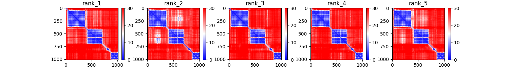

# Alphafold in ibex
---
Follow these steps to run alphafold in ibex:

1. Login to ibex through your Terminal application (mac) with the command:

    ```bash
    $ ssh [your_username]@glogin.ibex.kaust.edu.sa
    ```

   For logging in on Windows, you need an ssh client application such as [PuTTY](https://www.putty.org/).

2. Go to your scratch directory in ibex:

    ```bash
    $ cd /ibex/scratch/[your_username]/
    ```

3. Clone this repository and `cd` into the directory created. The `git clone` command is done only once, once you have the repository just go directly to it.

    ```bash
    $ git clone https://github.com/strubelab/alphafold.git
    $ cd alphafold
    ```

4. Load the `alphafold` and `cuda libraries`

    ```bash
    module load alphafold cuda/11.2.2
    ```

5. Edit the following lines in the `run_monomer.sbatch` or `run_multimer.sbatch` scripts.

    ```
    fasta_file=input/YOUR_SEQUENCE.fasta
    out_dir=output
    recycles=3
    ```

    Where:
    
    - `fasta_file`: path to the fasta file with the sequence(s) that you want to model:
      - if monomeric, only a single sequence
      - if multimeric, include all the sequences. Repeat each sequence multiple times according to the number of subunits.
    
    - `out_dir`: directory to save the outputs
    - `recycles`: number of times to recycle the outputs through the network to get potentially better models. 3 is recommended.

  - You can edit the file with a command-line editor such as `nano`:
  
    - `$ nano run_monomer.sbatch`
    - Edit the file
    - Save with `Ctrl+O`, check the name and press `Enter`
    - Exit with `Ctrl+X`


6. Submit the script to ibex:

    ```bash
    # For modeling monomers
    $ sbatch run_monomer.sbatch

    # For modeling multimers
    $ sbatch run_multimer.sbatch
    ```

7. Check the job status:

    ```bash
    $ squeue -u [user_name]
    ```
   
   When the job is finished (you can't see it in the list when running the previous command), look at the output folder and confirm that all the files are present:

   ```bash
   $ ls -lh output/[protein_name]

   -rw-r--r-- 1 guzmanfj g-guzmanfj 115M Dec  4 01:16 features.pkl
   drwxr-xr-x 2 guzmanfj g-guzmanfj    4 Dec  4 01:16 msas
   -rw-r--r-- 1 guzmanfj g-guzmanfj 1.3M Dec  4 02:43 ranked_0.pdb
   -rw-r--r-- 1 guzmanfj g-guzmanfj 1.3M Dec  4 02:43 ranked_1.pdb
   -rw-r--r-- 1 guzmanfj g-guzmanfj 1.3M Dec  4 02:43 ranked_2.pdb
   -rw-r--r-- 1 guzmanfj g-guzmanfj 1.3M Dec  4 02:43 ranked_3.pdb
   -rw-r--r-- 1 guzmanfj g-guzmanfj 1.3M Dec  4 02:43 ranked_4.pdb
   -rw-r--r-- 1 guzmanfj g-guzmanfj  370 Dec  4 02:43 ranking_debug.json
   -rw-r--r-- 1 guzmanfj g-guzmanfj 1.3M Dec  4 01:40 relaxed_model_1_ptm.pdb
   -rw-r--r-- 1 guzmanfj g-guzmanfj 1.3M Dec  4 01:56 relaxed_model_2_ptm.pdb
   -rw-r--r-- 1 guzmanfj g-guzmanfj 1.3M Dec  4 02:12 relaxed_model_3_ptm.pdb
   -rw-r--r-- 1 guzmanfj g-guzmanfj 1.3M Dec  4 02:27 relaxed_model_4_ptm.pdb
   -rw-r--r-- 1 guzmanfj g-guzmanfj 1.3M Dec  4 02:43 relaxed_model_5_ptm.pdb
   -rw-r--r-- 1 guzmanfj g-guzmanfj 547M Dec  4 01:27 result_model_1_ptm.pkl
   -rw-r--r-- 1 guzmanfj g-guzmanfj 547M Dec  4 01:49 result_model_2_ptm.pkl
   -rw-r--r-- 1 guzmanfj g-guzmanfj 548M Dec  4 02:05 result_model_3_ptm.pkl
   -rw-r--r-- 1 guzmanfj g-guzmanfj 548M Dec  4 02:21 result_model_4_ptm.pkl
   -rw-r--r-- 1 guzmanfj g-guzmanfj 548M Dec  4 02:35 result_model_5_ptm.pkl
   -rw-r--r-- 1 guzmanfj g-guzmanfj  823 Dec  4 02:43 timings.json
   -rw-r--r-- 1 guzmanfj g-guzmanfj 644K Dec  4 01:27 unrelaxed_model_1_ptm.pdb
   -rw-r--r-- 1 guzmanfj g-guzmanfj 644K Dec  4 01:49 unrelaxed_model_2_ptm.pdb
   -rw-r--r-- 1 guzmanfj g-guzmanfj 644K Dec  4 02:05 unrelaxed_model_3_ptm.pdb
   -rw-r--r-- 1 guzmanfj g-guzmanfj 644K Dec  4 02:21 unrelaxed_model_4_ptm.pdb
   -rw-r--r-- 1 guzmanfj g-guzmanfj 644K Dec  4 02:36 unrelaxed_model_5_ptm.pdb
   ```

8. Run the script for processing the outputs and making plots:

    ```bash
    $ ./process_results.py [fasta_file] [af_outputs]
    ```

    Where:

    - `fasta_file` is the path to the same fasta file that was submitted to alphafold.
    - `af_outputs` is the same directory indicated in the previous script that now contains the alphafold outputs.


9. Look for your plots in the directory `[af_outputs]/[sequence_name]/plots`


## Results

### Protein 2D plots

2D pictures of the proteins colored by pLDDT score, indicating the rank and the model name.

`plots/rank_[12345]_model_[model_name].png`


Note: some times there are discrepancies between the model ranking given by alphafold (structures named `ranked_*.pdb`), and the ranking indicated here, obtained by averaging the pLDDT scores. You should probably compare both.


### Predicted aligned error:
Metric for assessing inter-domain accuracy. See the full explanation at the bottom of every entry in the AF database (e.g. https://alphafold.ebi.ac.uk/entry/Q5VSL9)

`plots/pae.png`


### Predicted contacts

`plots/predicted_contacts.png`


### Predicted distances

`plots/predicted_distances.png`


### Predicted pLDDT

`plots/plddts.png`


The numbers in parenthesis are the average pLDDTs for the whole sequence.

### PDB structures

The ones you want to look at will be `relaxed_model_*.pdb` and/or `ranked_*.pdb`


## Troubleshooting / FAQs

- What is ibex?

  Ibex is a computer cluster that you can access to run "jobs" or execute programs that require large amounts of memory, CPU or GPU power. If you want to learn more you can check out the [Ibex training site](https://www.hpc.kaust.edu.sa/ibex/training) or the [user guide](https://www.hpc.kaust.edu.sa/ibex/ibex_guide).

- What is a terminal?

  If you're not familiar with the use of a Unix terminal/shell, you would greatly benefit from watching this [introductory workshop](https://www.youtube.com/watch?v=QB4JgAVgJHo) by the KAUST Visualization Core Lab, inspired from this [short course](https://swcarpentry.github.io/shell-novice/) by Software Carpentry.

- I don't see my job when typing `squeue -u [my_username]` in ibex, and the output directory is empty/doesn't have all the files with the results.

  If this happens, something might have gone wrong with the Alphafold execution. You should take a look at the file with the standard output from ibex, whose location is indicated by the `#SBATCH -o` parameter in the `run_[monomer|multimer].sbatch` file. The default location is in the `out_ibex` directory, so to look at this file you could do:

  ```bash
  $ tail out_ibex/Alphafold2.[jobid].out
  ```

  Take a look at the output and it will tell you if the program was stopped due to time or memory limitations, or if there was some other error. In the first two cases, you would change the following lines in the `run_[monomer|multimer].sh` script:

  ```
  #SBATCH --time=05:00:00
  #SBATCH --mem=64G
  ```

  From my own experience, the following values should work for the corresponding **total** sequence length (sum of all sequences in the input):

  **~60 residues**

  ```
  #SBATCH --time=01:00:00
  #SBATCH --mem=64G
  ```

  **~350 residues**

  ```
  #SBATCH --time=02:00:00
  #SBATCH --mem=64G
  ```

  **~1,000 residues**

  ```
  #SBATCH --time=10:00:00
  #SBATCH --mem=128G
  ```

- Why don't I just ask for as many resources as possible to prevent the program from failing?

  If you ask for more resources than your job will need, you might have to wait longer for those resources to become free and be assigned to you. Also you would prevent other users from accessing those resources for as long as your job is running. Remember that ibex is used by many other people :)
